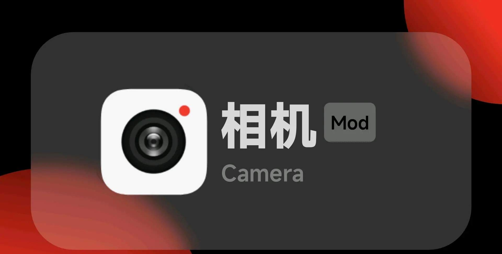

# 应用信息

应用：小米HyperOS相机

版本名：Mod_CNNRALR_5.3.240715.0

版本号：502307150

更新通道：Mod_CNNRALR

底层版本：5.3.240715.0（532407150）

应用大小：171MB(安装完之后)

API:

        MinSdkVersion:29 (Android 10 Queen Cake)

        TargetSdkVersion:33 (Android 13 Tiramisu)

打包时间：(UTC+8:00, Beijing) 2024-07-15 19:11:23

# 更新日志

1. 首次发布

Mod 特性：

1. 解锁 众多功能；

2. 新增 更多功能；

3. 优化 成像品质及调色；

4. 新增徕卡水印。

已知问题：

1. Xiaomi 11 Ultra 背屏不可用。

2. Redmi Note13系列和Redmi K70系列徕卡水印不可用。

# 注意事项

1. 需要root，LSPosed和核心破解；

2. 出现重大问题请及时反馈并卸载更新；

3. 仅支持官方计划维护 HyperOS 的设备；

4. 不支持非官方 ROM 及官改系统的维护.

# 常见问题

问：如果没有 root 权限能否安装使用？

答：不能，此应用需要 root，LSPosed 和核心破解。

问：非小米品牌的手机可以使用吗？

答：不可以，仅支持官方计划维护 HyperOS 的设备。

问：安装后出现卡顿怎么办？

答：请先检查是否满足安装要求，若仍有问题请及时反馈并卸载更新。

希望大家在使用小米 HyperOS 相机的过程中，能够享受到更多优质的拍摄体验，同时也感谢大家对我们的支持和信任。

问：应用更新频率如何？

答：我们会根据用户的反馈和系统的优化需求不定期进行更新，以提供更稳定和优质的服务。

问：安装此应用是否会影响手机的保修？

答：正常安装和使用不会影响保修，但如果因违规操作导致手机出现故障则可能会失去保修资格。

在此，我们再次提醒大家，遵循相关的安装和使用规则，让小米 HyperOS 相机为您的生活增添更多精彩瞬间。

# 下载链接

[Xiaomi Camera官方版下载丨最新版下载丨绿色版下载丨APP下载-123云盘](https://www.123pan.com/s/7aq8Vv-l0yB3.html)

